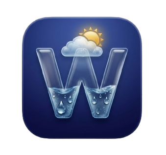

# 🌦️ Abohawa (আবহাওয়া) — Modern Weather App

<p align="center">
  
</p>

<p align="center">
  <b>A sleek, ultra-fast, and hyper-local weather application built with React Native, Expo SDK 51, and React Native Reanimated.</b>
</p>

<p align="center">
  
  
  
  
  
</p>

<p align="center">
  <a href="https://expo.dev/accounts/shakib_akando/projects/abohawa/builds/3c40f419-8088-407d-b210-9f1554a77e0f">
    
  </a>
</p>

---

## 📥 Download App (Android APK)

Get the latest build directly on your Android device:

| Version | Platform | Status | Direct Download |
|:---:|:---:|:---:|:---:|
| **v1.0.0** | Android (Universal `.apk`) | 🟢 Stable | [**📲 Download Abohawa APK**](https://expo.dev/accounts/shakib_akando/projects/abohawa/builds/3c40f419-8088-407d-b210-9f1554a77e0f) |

> 💡 **Installation Tip:** When installing on Android, if Google Play Protect shows a prompt, tap **"More details"** ➔ **"Install anyway"**.

---

## ✨ Features

### 📍 Hyper-Local & Global Weather Intelligence
- **Real-Time GPS Location:** Automatic device coordinate detection with precise reverse geocoding to your exact union, neighborhood, and city name.
- **Global Search:** Fast debounced city and airport search powered by Open-Meteo Geocoding.
- **Saved Locations:** Manage multiple cities with one-tap switching and persistent local storage.

### 🎨 Immersive & Dynamic Visuals
- **Physics-Based Animated Backgrounds:** Custom particle animations powered by `react-native-reanimated` for rain drops, thunder/lightning flashes, drifting clouds, and solar rays.
- **Day/Night Cycle Awareness:** Automatic celestial color transitions according to exact solar sunrise/sunset times.
- **Micro-Animations & Glassmorphic UI:** Smooth, fluid transitions with translucent glass cards, tactile haptics, and zero lag.

### 📊 Deep Weather Analytics & Charts
- **Glanceable Hero View:** Instant 2-second readout of temperature, feels like, high/low range, and conditions.
- **24-Hour & 7-Day Forecasts:** Hourly temperature timeline and comprehensive 7-day extended forecasts.
- **Interactive SVG Charts:** Temperature & precipitation curve visualization rendered with `react-native-svg`.
- **Air Quality Index (AQI):** Detailed air health breakdown including PM2.5, PM10, O3, and NO2 pollutants.
- **UV Index Gauge:** Solar intensity tracker with real-time UV exposure safety recommendations.
- **Solar Arc Card:** Visual sun position tracker with sunrise, sunset, and total daylight hours.
- **Quick Metrics:** Humidity, wind speed/direction, barometric pressure, visibility distance, and dew point.

### 🌐 Bilingual Support (i18n)
- Seamless one-tap language switcher supporting **English** and **বাংলা (Bangla)** with natural, localized weather phrases.

### ⚡ Performance & Offline Capabilities
- **Offline Cache:** Instant cached weather retrieval powered by TanStack React Query and AsyncStorage.
- **Reduce Motion Mode:** Battery-saver option that gracefully pauses GPU animations.
- **Live Simulator:** Built-in weather preview simulator in settings to test all visual weather conditions.

---

## 📱 Screenshots & Previews

| Home Screen | Hourly & Daily Forecast | Deep Analytics & AQI | City Manager |
|:---:|:---:|:---:|:---:|
| ☀️ **Glanceable Hero** | 🌧️ **24h & 7d Strip** | 💨 **AQI & Solar Arc** | 📍 **Saved Cities** |

---

## 🛠️ Tech Stack & Architecture

- **Framework:** [Expo (SDK 51)](https://expo.dev/)
- **Core:** [React Native 0.74.5](https://reactnative.dev/)
- **Language:** [TypeScript](https://www.typescriptlang.org/)
- **Navigation:** [Expo Router (v3)](https://docs.expo.dev/router/introduction/) (File-based tabs architecture)
- **Animations:** [React Native Reanimated 3](https://docs.swmansion.com/react-native-reanimated/)
- **Charts & Graphics:** [React Native SVG](https://github.com/software-mansion/react-native-svg)
- **State Management:** [Zustand](https://github.com/pmndrs/zustand)
- **Data Fetching & Cache:** [TanStack React Query (v5)](https://tanstack.com/query/latest) & [AsyncStorage](https://react-native-async-storage.github.io/async-storage/)
- **Iconography:** [Lucide Icons for React Native](https://lucide.dev/)
- **Data APIs:** [OpenWeatherMap API](https://openweathermap.org/) & [Open-Meteo](https://open-meteo.com/)

---

## 📂 Project Structure

```bash
weather-app/
├── app/                      # Expo Router navigation
│   ├── (tabs)/               # Bottom tab screens
│   │   ├── _layout.tsx       # Tab bar configuration & Lucide icons
│   │   ├── index.tsx         # Home screen (Hero, Insights, Hourly, Daily)
│   │   ├── details.tsx       # Analytics screen (Precipitation, AQI, UV, Solar Arc)
│   │   ├── cities.tsx        # City manager & search
│   │   └── settings.tsx      # Settings, Language (EN/BN), Units, & Cache
│   └── _layout.tsx           # Root layout & providers (React Query, Safe Area)
├── assets/                   # App icons, splash screens, and favicons
├── components/               # Modular UI components
│   ├── AnimatedBackground.tsx# Reanimated particle & weather background system
│   ├── WeatherHero.tsx       # Main glanceable temperature display
│   ├── HourlyStrip.tsx       # 24-hour horizontal forecast
│   ├── DailyForecast.tsx     # 7-day forecast cards
│   ├── PrecipitationChart.tsx# SVG curve chart for rain & temperature
│   ├── AqiCard.tsx           # Air quality gauge & pollutant breakdown
│   ├── UvGauge.tsx           # UV solar index visualizer
│   ├── SunArcCard.tsx        # Solar arc tracking card
│   ├── CityCard.tsx          # Saved city interactive card
│   ├── InsightCard.tsx       # Dynamic weather intelligence card
│   ├── QuickStatsRow.tsx     # Humidity, wind, pressure, visibility stats
│   └── WeatherIcon.tsx       # Condition-mapped dynamic iconography
├── constants/                # Configuration, design tokens & translations
│   ├── i18n.ts               # Complete English & Bangla localized dictionaries
│   ├── theme.ts              # Spacing, typography & glassmorphism tokens
│   ├── colors.ts             # Palette definitions
│   └── config.ts             # Weather API configurations
├── hooks/                    # Custom React hooks
│   └── useWeather.ts         # Query hook with offline fallback & caching
├── services/                 # API, Storage & Geocoding services
│   ├── weatherApi.ts         # OpenWeather & Open-Meteo fetchers & parser
│   ├── location.ts           # Device GPS & reverse geocoding
│   ├── geocoding.ts          # Global city search
│   └── storage.ts            # AsyncStorage persistence layer
├── store/                    # Global state
│   └── useAppStore.ts        # Zustand store for active city, units, theme & i18n
├── types/                    # TypeScript interfaces & types
│   └── weather.ts            # Weather, forecast, and location schemas
├── app.json                  # Expo app configuration
├── eas.json                  # EAS Build configuration for APK / AAB
└── package.json              # Dependencies and scripts
```

---

## 🚀 Getting Started

### Prerequisites
- [Node.js (v18 or higher)](https://nodejs.org/)
- [npm](https://www.npmjs.com/) or [yarn](https://yarnpkg.com/)
- [Expo Go App](https://expo.dev/client) on your Android / iOS device (or an emulator)

### 1. Clone the repository
```bash
git clone https://github.com/Md-Shakib-Akando/Abohawa.git
cd Abohawa
```

### 2. Install dependencies
```bash
npm install
```

### 3. Start development server
```bash
npx expo start -c
```
- Scan the displayed QR code with the **Expo Go** app on Android or the Camera app on iOS.
- Press `a` in the terminal to launch in Android Emulator or `w` for Web.

---

## 📦 Building Standalone APK (Android)

The repository is pre-configured with EAS Build for creating standalone `.apk` packages.

1. Install EAS CLI globally (optional):
   ```bash
   npm install -g eas-cli
   ```
2. Run the preview build command:
   ```bash
   npx eas-cli build -p android --profile preview
   ```
3. Once the cloud build completes, download the generated `.apk` file directly to your Android device and install.

---

## 👨‍💻 Developer & Credits

Crafted with ❤️ by **[Shakib Akando](https://github.com/Md-Shakib-Akando)**

- **GitHub:** [@Md-Shakib-Akando](https://github.com/Md-Shakib-Akando)
- **Project Repository:** [https://github.com/Md-Shakib-Akando/Abohawa](https://github.com/Md-Shakib-Akando/Abohawa)

---

## 📄 License

This project is licensed under the [MIT License](LICENSE).
